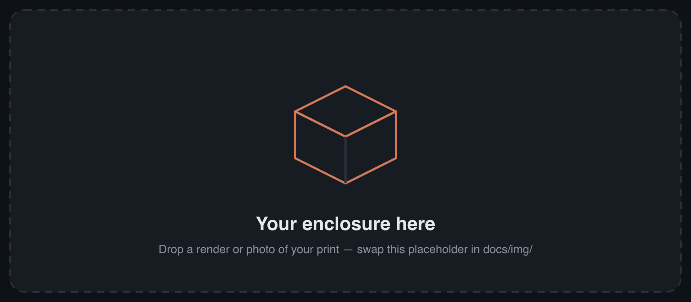
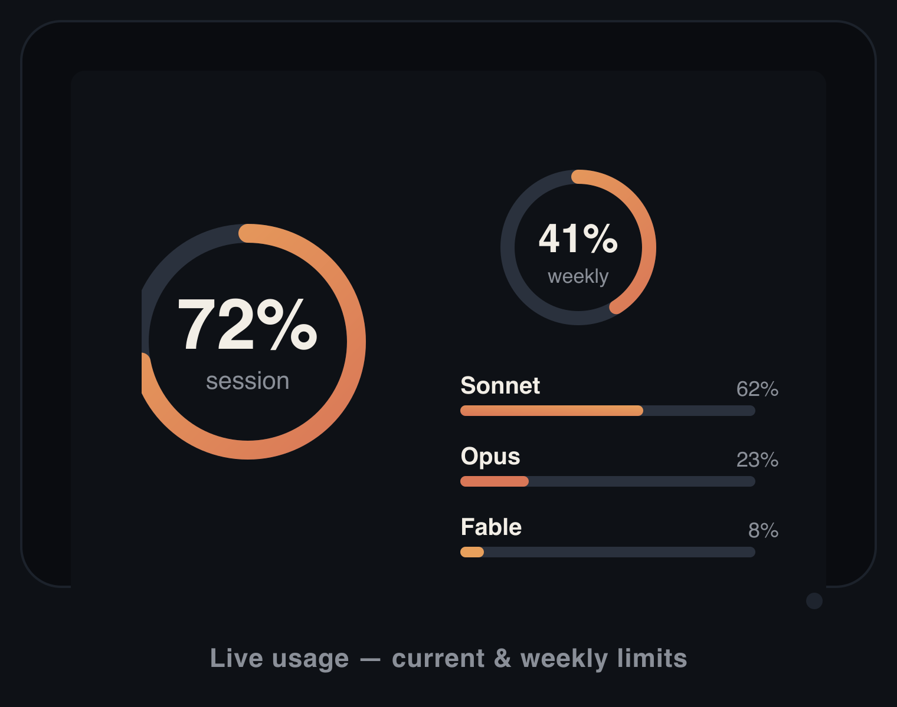
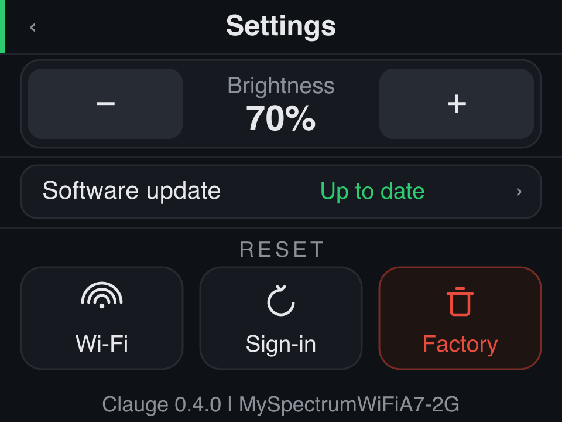
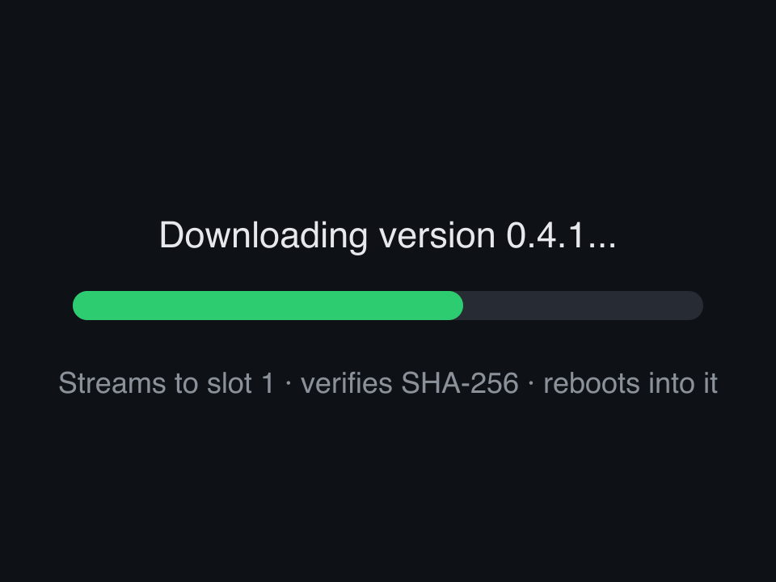

<div align="center">


**A little desk gauge for your Claude Code usage.**
Your 5-hour session and 7-day week, as two live dials you can glance at all day.

<p>
  
  
  
  
</p>



</div>

<table>
  <tr>
    <td width="33%"><br><sub><b>Live usage</b> - session &amp; weekly, one page per provider</sub></td>
    <td width="33%"><br><sub><b>Settings</b> - brightness and updates</sub></td>
    <td width="33%"><br><sub><b>Updates</b> - over the air, and safe</sub></td>
  </tr>
</table>

## What is Clauge?

Clauge is a small desk display that shows how much of your Claude Code usage you've spent - the same numbers as the `/usage` command, but always in view. It reads your **5-hour session** limit and your **7-day weekly** limit and draws each as a dial, green while you have room, amber as you get close, red when it's nearly gone. Glance over, know where you stand, keep working.

Under the dials it also shows how full your **context window** is, which model you're on, and a small pip telling you whether Claude Code is working, waiting on you, or has gone quiet mid-task. With more than one session open it shows how many, and how many subagents are running across them.

It runs on a cheap (~$12) ESP32 touchscreen. Plug it into your computer, run the setup once, and it sits on your desk and keeps itself up to date.

### Where the numbers come from

Clauge never sees a credential, and never reads your conversations. It reads figures other programs have already worked out, from as many of these as you have:

| Source | Gives | Needs |
|---|---|---|
| Claude Code's status line | both limits, reset times, context, model | nothing - set up by `clauge install` |
| Claude Desktop's usage cache | both limits | nothing - read if the app is installed |
| Claude Code's hooks | per-session busy / waiting / stuck / rate-limited, and live subagent count | nothing - set up by `clauge install` |
| Codex CLI's own session log | both limits and reset times, for Codex | nothing - read if Codex is installed |
| [Browser extension](extension/) | nothing today - claude.ai sends no rate-limit headers ([why](docs/next-steps.md)) | optional, load it yourself |

When two of them disagree, the most recently observed number wins - field by field, so a source that knows your reset time still supplies it even when a fresher one takes over the percentage. `docs/multi-provider.md` has the details.

**Two providers get a page each**, rather than sharing the dials. The name at the bottom of the screen says whose numbers you are looking at, and tapping it switches - as does a swipe up or down. Each page carries its own freshness, so a Codex reading that has gone quiet never puts "reading is old" over live Claude numbers. Changing page moves the needles from one reading to the other instead of redrawing the screen, because this is an instrument and that is what an instrument does.

## What's in here

| Path | What's there |
|------|--------------|
| `firmware/` | The device firmware (Zephyr, C) - this is the product |
| `firmware/src/ota.c` | The update engine: signed install + automatic rollback |
| `pc/`, `claude_usage_bridge.py` | The USB bridge and its setup, shipped as one binary - this is how a board gets its numbers |
| `tools/` | Build, flash, and release helpers |
| `docs/img/` | Logo, icons, and the screen renders above |

## Hardware

Clauge runs on the **ESP32-2432S028 "Cheap Yellow Display" (CYD)** - a popular all-in-one board with a 2.8" 320×240 touchscreen, for around $12. The common variants all work.

**Get the board:** [search AliExpress for "ESP32-2432S028"](https://www.aliexpress.com/w/wholesale-esp32%2D2432s028.html)

### Enclosure

A 3D-printable case gives the bare board a home on your desk. **[Download the CAD files](#)** *(coming soon)*

## Connecting it

Clauge reads your usage over the **USB cable**, from Claude Code itself. Plug the board into your computer and run the setup below; your usage streams over the cable, and the same connection handles updates.

The device never joins your network, never signs in to anything, and never holds a credential - the numbers come from the Claude Code already running on your machine.

### Setting it up

**One file. Download it, run it, done.** No Python, no package manager,
nothing to keep installed.

```bash
# macOS (Apple silicon)
curl -fsSL -o clauge https://github.com/KfirLevy258/Clauge/releases/latest/download/clauge-macos-arm64
# macOS (Intel):  .../clauge-macos-x86_64
# Linux:          .../clauge-linux-x86_64

chmod +x clauge && ./clauge
```

That is the whole setup. It finds the board by itself and starts again every
time you log in - plug the cable in and the panel comes up.

**Then delete the file.** It copies itself to `~/.clauge/bin` on the way
through, so nothing has to stay in your Downloads folder.

```bash
~/.clauge/bin/clauge status      # is the panel getting data?
~/.clauge/bin/clauge uninstall   # put everything back
```

*Downloading with `curl` rather than a browser is deliberate: macOS marks
browser downloads as quarantined and refuses to run them until the app is
notarised. `curl` does not, so this works today.*

**Needs Claude Code 2.1.100 or newer.** Clauge reads the usage figures from
the status line, and older versions do not put them there - 2.1.0 has no
usage figures in that payload at all, so the panel would stay blank. Update
Claude Code first if yours is older.

### What the installer changes

Over USB, Clauge reads the usage figures Claude Code has already worked out,
rather than asking Anthropic for them itself. Claude Code hands those figures
to whatever command is set as its **status line**, so that is the one setting
Clauge has to change.

| | |
|---|---|
| Changes | `statusLine.command` in `~/.claude/settings.json` |
| Creates | `~/.clauge/` - a copy of the program itself and the small status line script, so the file you downloaded can be deleted |
| Creates | a login item, so the bridge starts with your session (a LaunchAgent on macOS, a user systemd unit on Linux, a Scheduled Task on Windows) |
| Leaves alone | every other key in `settings.json`, and the file's own formatting and permissions. Nothing is installed system-wide |
| Reads or stores | nothing else - no credential, no token, no account data |

**It does this without asking**, so that plugging the board in is the whole
setup. It prints all of the above before it changes anything, and every part
of it is reversible:

```bash
~/.clauge/bin/clauge uninstall
```

**If you already have your own status line, it keeps working.** Clauge records
your existing command, and runs it after capturing the usage figures - your bar
renders exactly as before. Uninstalling puts your command back unchanged, and
will not touch a status line Clauge did not install.

## Build &amp; flash

You only need this to put firmware on a board yourself (after that, it updates over the air). It uses the [Zephyr](https://zephyrproject.org/) toolchain.

The default build is what ships: USB only, with no radio, no sign-in and no token store compiled in. The on-device Wi-Fi path is still here and still builds - add `-DEXTRA_CONF_FILE=wifi.conf` to the command below - it is simply not in anything released.

```bash
source ~/zephyr-v4.4.0/.venv/bin/activate
source ~/zephyr-v4.4.0/zephyr/zephyr-env.sh

cd firmware
west build --sysbuild -d build-sb -b esp32_devkitc/esp32/procpu . \
  -- -DSB_CONFIG_BOOTLOADER_MCUBOOT=y -DUSE_CCACHE=0 \
  -DSB_CONFIG_BOOT_SIGNATURE_KEY_FILE="\"$HOME/.clauge/ota_signing_key_p256.pem\""

# Which flash path you need depends on the board -- stock CYDs are unfused,
# and the two kinds cannot boot each other's images:
espefuse.py --port <port> summary | grep FLASH_CRYPT_CNT   # odd bits set = encrypted

# Unfused board -- two commands, because west flash writes only the app at
# 0x20000 and leaves MCUboot at 0x1000 untouched:
west flash -d build-sb --esp-device <port> --esp-baud-rate 115200
esptool.py --port <port> --baud 115200 write_flash 0x1000 build-sb/mcuboot/zephyr/zephyr.bin

# Fused board (flash-encryption eFuses burned) -- the script re-checks the
# chip itself and refuses one it would leave dark:
../tools/flash_encrypted.sh
```

Full details - the signing key, the encrypted-flash setup, and the release flow - are in **[firmware/README.md](firmware/README.md)**.

## Updates

Clauge is two halves that ship as one release: the firmware on the board, and the app on your computer. They always carry the same version number.

Clauge checks for a new release as soon as it starts up, and if it finds one it asks you - **Update now** or **Later** - right on the gauge screen. One tap installs both halves. If the release also carries a newer app, the screen says so, and that half goes first: the new app is what knows how to drive the new firmware.

The board has no network of its own, so the app does the work. It downloads the release, checks it against the hash the release publishes, and writes it over the same cable - then reads it back off the chip to confirm what landed there. The screen goes dark for about four minutes while that happens; it tells you first, and comes back on the new version. Because this route writes the running slot directly it has no automatic rollback, which is a fair trade when the machine that can reflash it is the one already plugged in.

You get a confirmation on screen once the new version is up.

**Updating the app on your own.** You can also run it yourself:

```sh
~/.clauge/bin/clauge update     # fetch and install a newer app
~/.clauge/bin/clauge status     # which versions are you on?
```

The settings screen shows both versions, and says **App is old** when the half on your computer is the one that is behind.

Automatic app updates are off unless a release turns them on. To keep them off whatever a release says, `touch ~/.clauge/no-auto-update`.

**Both halves are signed, by two separate keys.** Firmware images are signed with a key only you hold, and the bootloader rejects anything else - so nobody can push firmware to your device, not by forking this repo, not by uploading a release, even though the repo is public. The release manifest that drives app updates is signed with a second key, and the app refuses to read a manifest that does not verify. Two keys rather than one because they protect different things, and one compromise should not be two.

## Security &amp; privacy

- **Only you can update your device.** Firmware must be signed with your private key (kept off this repo, at `~/.clauge/…`); the bootloader rejects anything else. App updates must be signed with a second key of yours, or the app will not install them. The public repo only lets people read and download the firmware, which holds no secrets.
- **The device holds no credential.** It never signs in and never talks to Anthropic. The figures come from the Claude Code on your own machine, which has already worked them out, and reach the board over the cable. There is no token on the device to leak, and nothing to revoke if you sell or lend it.
- **The setup touches one setting.** `statusLine.command` in `~/.claude/settings.json`, and nothing else - see "What the installer changes" above. It is reversible with one command.
- The on-device Wi-Fi and sign-in path still exists in this repository, behind `CONFIG_CLAUGE_WIFI_MODE`, but is **not built into shipped firmware** - the release script refuses to publish an image containing it.

## The status dot

A small dot in the top-right corner tells you how fresh the numbers are:

| Dot | Meaning |
|-----|---------|
| 🟢 green | Connected - live data |
| 🟠 amber | Stale - showing the last good numbers, because Claude Code has not refreshed them recently or the window they describe has since reset |
| 🔴 red | Error |
| ⚪ grey | Signed out |
