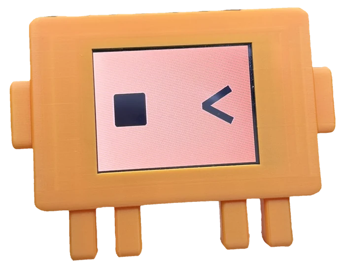
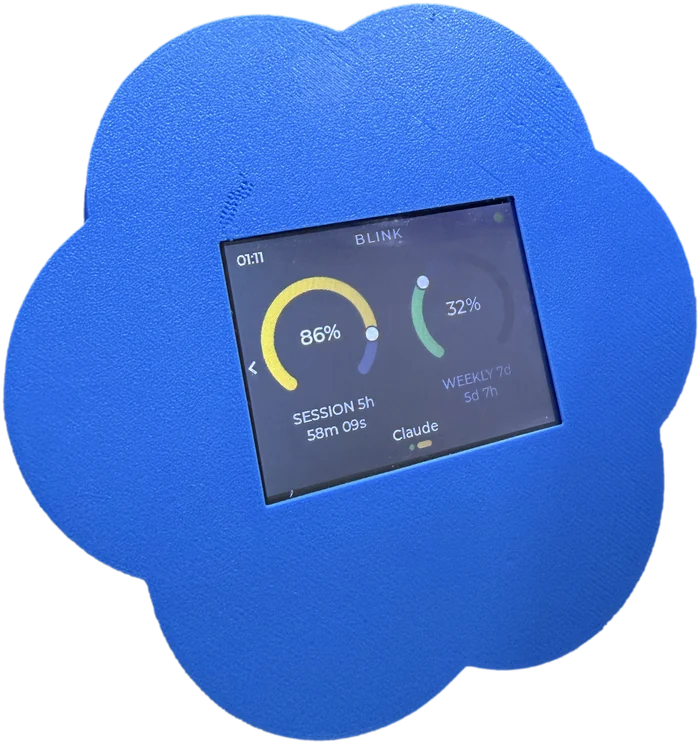
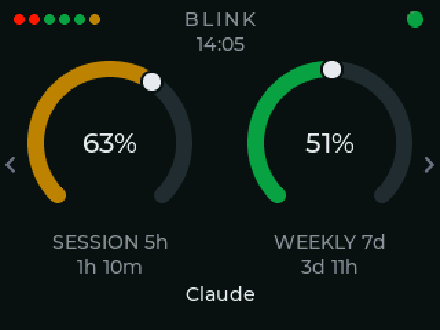
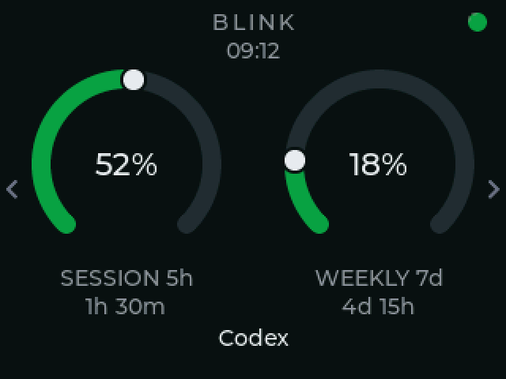
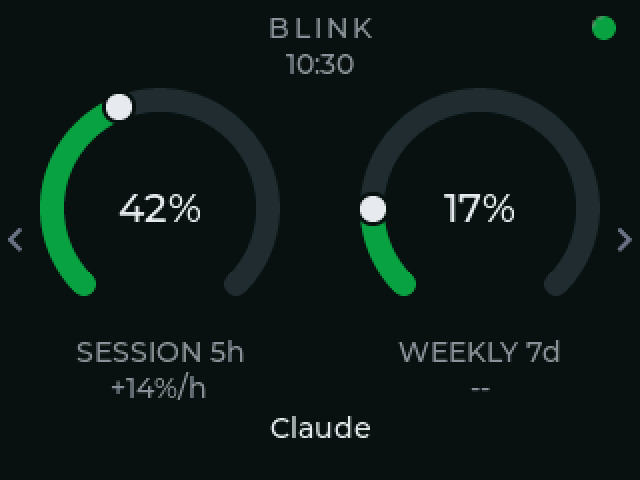

<div align="center">


**Your Claude Code and Codex usage, as two live dials on your desk.**

<p>
  <a href="https://github.com/KfirLevy258/Blink/releases/latest"></a>
  
  
  
</p>

<table>
  <tr>
    <td align="center"></td>
    <td align="center"></td>
  </tr>
  <tr>
    <td align="center"><sub><b>Claude edition</b></sub></td>
    <td align="center"><sub><b>Codex edition</b></sub></td>
  </tr>
</table>

</div>

## What it is

BLINK is a small touchscreen that shows the same numbers as Claude Code's `/usage` command, always in view: your **5-hour session** and your **7-day week**, each as a dial that turns from green to amber to red, with a countdown to its reset. It plugs into your computer over USB, sets itself up in one command, and keeps itself updated.

## Features

- **Two dials, two countdowns.** Session and weekly limits, and the time until each one resets.
- **An activity light.** Whether Claude Code is working, waiting on you, or has gone quiet mid-task, across every session you have open.
- **A page per provider.** Claude and Codex each get their own screen. Tap the name or swipe to switch; the needles move from one reading to the other.
- **Claude Desktop too.** With Desktop alone the dials show both percentages and how fast the window is filling.
- **Nothing to sign in to.** It reads figures Claude Code and Codex have already written to disk. No credential, no network, nothing sent anywhere.
- **Updates over the cable.** A new release asks on screen; one tap installs both the firmware and the app. Both halves are signed.
- **Cheap, open hardware.** An ESP32 "Cheap Yellow Display" (~$12) and a 3D-printed case.

## The screens

<table>
  <tr>
    <td width="33%"><br><sub><b>Claude</b> - session and weekly, with the countdown to each reset</sub></td>
    <td width="33%"><br><sub><b>Codex</b> - its own page, swipe or tap the name to switch</sub></td>
    <td width="33%"><br><sub><b>Claude Desktop alone</b> - no reset times exist, so a rate instead</sub></td>
  </tr>
</table>

<sub>Rendered by the shipping firmware's own drawing code, not mocked up.</sub>

## Setup

One file. Download it, run it, delete it. It copies itself to `~/.blink/bin`, finds the board, and starts again every time you log in.

```bash
# macOS (Apple silicon)
curl -fsSL -o blink https://github.com/KfirLevy258/Blink/releases/latest/download/blink-macos-arm64
# macOS (Intel):  .../blink-macos-x86_64
# Linux:          .../blink-linux-x86_64

chmod +x blink && ./blink
```

On Windows, download `blink-windows-x86_64.exe` from the [latest release](https://github.com/KfirLevy258/Blink/releases/latest) and run it.

```bash
~/.blink/bin/blink status      # is the panel getting data?
~/.blink/bin/blink uninstall   # put everything back
```

Needs Claude Code 2.1.100 or newer. The installer changes one file, `~/.claude/settings.json` (the status line command and one hook per lifecycle event), says so before it does, and keeps your own status line running. Everything it does is reversible with `uninstall`.

## What it works with

| You use | You get |
|---|---|
| Claude Code, in a terminal or an IDE | Everything |
| Codex CLI | Everything, on its own page |
| Claude Desktop, without Claude Code | Percentages and a rate; no countdowns, no activity light |
| claude.ai in a browser | Nothing - there is no usage data to read |

## Privacy

BLINK never sees a credential and never sends anything anywhere. It keeps the last usage payload Claude Code wrote, readable by you alone, in `~/.blink/`. The device holds no token: nothing to leak, nothing to revoke if you lend it.

## Read more

- **[The full README](docs/README-full.md)** - how the numbers are found, what the installer changes line by line, ports and multiple boards, updates and signing, the decisions behind the first release
- **[firmware/README.md](firmware/README.md)** - building, flashing and signing the firmware yourself
- **[docs/multi-provider.md](docs/multi-provider.md)** - how two sources are merged into one reading
- **[docs/windows-check.md](docs/windows-check.md)** - the ten-minute check a Windows release needs a person for

<div align="center"><sub>Firmware: Zephyr, C. App: Python, shipped as one binary. Board: ESP32-2432S028.</sub></div>
