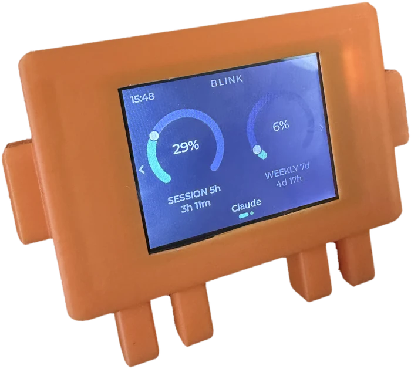

<div align="center">


**A little desk gauge for your Claude Code and Codex usage.**
Your 5-hour session and 7-day week, as two live dials you can glance at all day.

<p>
  
  
  
  
</p>



</div>

<table>
  <tr>
    <td width="33%"><br><sub><b>Claude</b> - session &amp; weekly, with the countdown to each reset</sub></td>
    <td width="33%"><br><sub><b>Codex</b> - its own page, swipe or tap the name to switch</sub></td>
    <td width="33%"><br><sub><b>Claude Desktop alone</b> - no reset times exist, so a rate instead</sub></td>
  </tr>
</table>

<sub>The three screens above are rendered from the shipping firmware's own drawing code (`tools/panel_render`), not mocked up.</sub>

## What is Blink?

Blink is a small desk display that shows how much of your Claude Code usage you've spent - the same numbers as the `/usage` command, but always in view. It reads your **5-hour session** limit and your **7-day weekly** limit and draws each as a dial, green while you have room, amber as you get close, red when it's nearly gone. Glance over, know where you stand, keep working.

Beside the dials is a small pip telling you whether anything is waiting on you -- across every Claude Code and Codex session you have open, one light: amber the moment a session has finished or is asking permission, a green pulse while everything is still working, red when something is stuck or rate-limited. Under them, a countdown to each window's reset.

It runs on a cheap (~$12) ESP32 touchscreen. Plug it into your computer, run the setup once, and it sits on your desk and keeps itself up to date.

### Where the numbers come from

Blink never sees a credential and never sends anything anywhere. It reads figures other programs have already worked out, from files they already write, and keeps only the figures: from Codex's session log it takes the one rate-limit line and nothing of the conversation; from Claude Code's status line it keeps the last payload (which also names your working directory and session), readable by you alone.

### What it supports, and how well

| You use | What the panel shows | |
|---|---|---|
| **Claude Code in a terminal** | Everything: both limits, both countdowns, the activity light | **Full** |
| **Claude Code in the VS Code / JetBrains extension** | The same. The extension runs the same CLI and reads the same `~/.claude/settings.json`, so the status line and hooks work identically | **Full** |
| **Claude Desktop, without Claude Code** | Both percentages and how fast the five-hour window is filling. **No countdowns, no activity light** | **Partial** |
| **Codex CLI** | Both limits and both countdowns, on its own page | **Full** |
| **claude.ai in a browser** | Nothing | **Not supported** |

**Why Claude Desktop is only half.** The app records two percentages and no reset timestamps — anywhere, in any file. That was checked exhaustively in August 2026: every JSON file it writes, its LevelDB and Session Storage and IndexedDB stores, its caches and its preferences plist. So there is no countdown to show, and the panel shows a **rate** instead (`+14%/h`) — measured from readings actually taken, not a guessed reset time. The activity light needs Claude Code's hooks, which a machine without Claude Code does not have. `blink install` says all of this on a machine in that state rather than reporting four successful steps.

**Why claude.ai is not supported.** A browser extension was built to read usage from response headers and measured against the real site: 178 responses, none carrying a rate-limit header of any kind. There is nothing to read. It was removed rather than shipped as a feature that does nothing. [`docs/next-steps.md`](next-steps.md) §A has the measurement.

### The sources

| Source | Gives | Needs |
|---|---|---|
| Claude Code's status line | both limits, reset times | nothing - set up by `blink install` |
| Claude Code's hooks | per-session busy / waiting / finished / rate-limited | nothing - set up by `blink install` |
| Claude Desktop's usage cache | both limits, and the burn rate derived from its history | nothing - read if the app is installed |
| Codex CLI's own session log | both limits and reset times, for Codex | nothing - read if Codex is installed |

**How each source is tested.** Claude Code: CI installs real releases (oldest supported, stable, latest, next) and checks the status-line contract is still there. Codex: CI reads the struct that defines `rate_limits` in Codex's own source at the latest release, and fails the day a field is renamed -- Codex will not write a log without an account, so the parser is pinned to a real captured log instead. Claude Desktop: a closed app no runner can launch; the parser is pinned to a real captured cache file, and `blink status` reports on the customer's machine whether today's file still parses.

When two of them disagree, the most recently observed number wins - field by field, so a source that knows your reset time still supplies it even when a fresher one takes over the percentage. [`docs/multi-provider.md`](multi-provider.md) has the details.

**Two providers get a page each**, rather than sharing the dials. The name at the bottom of the screen says whose numbers you are looking at, and tapping it switches - as does a swipe up or down. Each page carries its own freshness, so a Codex reading that has gone quiet never puts "reading is old" over live Claude numbers. Changing page moves the needles from one reading to the other instead of redrawing the screen, because this is an instrument and that is what an instrument does.

## What's in here

| Path | What's there |
|------|--------------|
| `firmware/` | The device firmware (Zephyr, C) - this is the product |
| `firmware/src/ota.c` | The update engine: signed install + automatic rollback |
| `pc/`, `claude_usage_bridge.py` | The USB bridge and its setup, shipped as one binary - this is how a board gets its numbers |
| `tools/` | Build, flash, and release helpers |
| `docs/img/` | Logo, icons, and the screen renders above |

## Hardware

Blink runs on the **ESP32-2432S028 "Cheap Yellow Display" (CYD)** - a popular all-in-one board with a 2.8" 320×240 touchscreen, for around $12. The common variants all work.

**Get the board:** [search AliExpress for "ESP32-2432S028"](https://www.aliexpress.com/w/wholesale-esp32%2D2432s028.html)

### Enclosure

A 3D-printable case gives the bare board a home on your desk. **[Download the CAD files](#)** *(coming soon)*

## Connecting it

Blink reads your usage over the **USB cable**, from Claude Code itself. Plug the board into your computer and run the setup below; your usage streams over the cable, and the same connection handles updates.

The device never joins your network, never signs in to anything, and never holds a credential - the numbers come from the Claude Code already running on your machine.

**Which port, and what if you have two boards.** It does not scan. The daemon
writes down the board it connected to, so every later start opens that port
directly.

On a machine that has never seen a board — a new install — there is nothing to
remember, so it identifies one by asking. It shortlists ports by USB-serial
chip id, then asks each politely: a short message the board answers and
nothing else does. If none answers quickly it goes round once more listening
for longer, because a board plugged in seconds ago may still be booting and
will send an unprompted ping shortly. Only then does it stop. That matters because the CH340 in these boards is also in a great deal
of hardware that is not one. A device that stays silent is left alone
**permanently**: the daemon then waits for something to be plugged or
unplugged rather than reopening ports on a timer, so a stranger's Arduino is
opened once and never poked again.

Only a board it has identified before may be reset. That is the recovery a
genuinely wedged unit needs, and it is precisely the thing an unknown device
must never be given.

**One daemon drives one board.** With several attached, the first that answers
wins and the others are ignored — the protocol, the board-side preference and
the update path are all written around a single unit. Name a specific one with
`blink run --port /dev/cu.usbserial-XXXX`. A second daemon on the same machine
waits rather than fighting for the port, and says so.

### Setting it up

**One file. Download it, run it, done.** No Python, no package manager,
nothing to keep installed.

```bash
# macOS (Apple silicon)
curl -fsSL https://github.com/KfirLevy258/Blink/releases/latest/download/blink-macos-arm64.tar.gz | tar xz && ./blink/blink
# macOS (Intel):  .../blink-macos-x86_64.tar.gz
# Linux:          .../blink-linux-x86_64.tar.gz

```

That is the whole setup. It finds the board by itself and starts again every
time you log in - plug the cable in and the panel comes up.

**Then delete the file.** It copies itself to `~/.blink/bin` on the way
through, so nothing has to stay in your Downloads folder.

```bash
~/.blink/bin/blink status      # is the panel getting data?
~/.blink/bin/blink uninstall   # put everything back
```

*Downloading with `curl` rather than a browser is deliberate: macOS marks
browser downloads as quarantined and refuses to run them until the app is
notarised. `curl` does not, so this works today.*

**Needs Claude Code 2.1.100 or newer.** Blink reads the usage figures from
the status line, and older versions do not put them there - 2.1.0 has no
usage figures in that payload at all, so the panel would stay blank. Update
Claude Code first if yours is older.

### What the installer changes

Over USB, Blink reads the usage figures Claude Code has already worked out,
rather than asking Anthropic for them itself. Claude Code hands those figures
to whatever command is set as its **status line**, so that is the one setting
Blink has to change.

| | |
|---|---|
| Changes | two keys in `~/.claude/settings.json`: `statusLine.command`, and one entry under `hooks` for each of ten Claude Code lifecycle events (`SessionStart`, `PreToolUse`, `Stop`, ... - the activity light is derived from them). Your own hooks are left in place |
| Creates | `~/.blink/` (readable by you alone) - a copy of the program, the status line script, the hook script, and a `state/` directory holding one small file per open session (event name, time, and the session and agent ids Claude Code generates - nothing else) |
| Creates | a login item, so the bridge starts with your session (a LaunchAgent on macOS, a user systemd unit on Linux, a Scheduled Task on Windows) |
| Leaves alone | every other key in `settings.json`, and the file's own formatting and permissions. Nothing is installed system-wide |
| Keeps | the last status line payload Claude Code sent, in `~/.blink/statusline.json`. Alongside the two usage figures it carries the session id, working directory and transcript path; only the figures are read, and nothing in it leaves the machine |
| Reads | Claude Desktop's usage cache and the tail of Codex's session log, when present; from each only the usage figures are kept. No credential, no token |

**It does this without asking**, so that plugging the board in is the whole
setup. It prints all of the above before it changes anything, and every part
of it is reversible:

```bash
~/.blink/bin/blink uninstall
```

**If you already have your own status line, it keeps working.** Blink records
your existing command, and runs it after capturing the usage figures - your bar
renders exactly as before. Uninstalling puts your command back unchanged, and
will not touch a status line Blink did not install.

## Programming a unit

If you are building a unit to ship, this is the whole job:

```bash
tools/burn-claude.sh          # or tools/burn-codex.sh
```

It finds the board, refuses a fused chip (this path writes plaintext, which a
fused ROM cannot read), builds signed with MCUboot, flashes **both** images,
boot-verifies, stamps the edition, then reboots and confirms the stamp
survived. It stops the local daemon for the duration and puts it back
afterwards, including on Ctrl-C.

The edition is **write-once**. Stamp every unit, not just Codex ones — `0`
means both "Claude" and "never stamped", so an unstamped Claude board can be
turned into a Codex one by anyone with a cable. A re-burn of the same edition
passes and says so; a burn of the *other* edition fails and tells you what the
unit already is. A unit programmed before the latch existed arrives **latched
as Claude** the first time it boots this firmware -- every unit built before
it was a Claude unit, and the alternative was delivering all of them
re-stampable by their owners. A bench board meant to become Codex needs its
config partition erased first (`esptool.py erase_region 0x3b0000 0x30000`).

Pass `--port` to name a board when more than one is attached, and `--no-build`
to reuse the last build.

### Company units

A unit sold to a company shows the company's logo after the boot animation:

```bash
tools/burn.sh --edition claude --logo acme.png     # a still, held for 3 s
tools/burn.sh --edition claude --logo acme.bin     # a clip built by tools/encode_logo.py
```

`--logo` takes a picture (scaled to fit the screen), a short video, a folder of
320x240 frames, or a `.bin` already built with `tools/encode_logo.py` (which
also previews one as a GIF: `--info acme.bin --preview acme.gif`). The logo is
written to its own flash partition in the same call as the firmware, and the
boot check insists the board saw it. It is a clip in the boot animation's own
format, so a still costs a few KB and a 3-second animation a couple of hundred;
the partition holds 512 KB.

There is no flag to set: the partition **is** the flag. A unit that never had
one written boots as an individual unit, and a burn *without* `--logo` erases
the partition, so a re-burned board is an individual unit again. Nothing over
USB can change it -- like the edition, it takes esptool with the board in
bootloader mode -- but unlike the edition it is not write-once, because a logo
is a fact about the customer, not the enclosure. OTA never touches it: the
firmware slots and the settings partition are exactly where they were.
Edition and logo are independent -- a company unit is still a Claude or a
Codex one.

### Tested without a board

`tests/ci/check_factory.sh` runs both scripts, unmodified, on every push: it
puts stub `esptool.py` / `espefuse.py` / `espsecure.py` on the PATH that
record their calls, and a fake `serial` module that plays a board -- it
replays a boot transcript on every reset and answers the edition message.
Eleven scenarios cover what matters on a production line: the images and
addresses of an individual burn and a company burn, that the logo partition
is erased when no logo was asked for, that a fused chip is refused, that a
board which cannot see the logo it was given (or shows one it should not
have), a wrong edition, a stale build, or a flash that dies mid-way each end
in `FAILED` rather than a boxed unit. Run it locally with
`sh tests/ci/check_factory.sh` (needs numpy and pillow).

## Build &amp; flash by hand

You only need this to put firmware on a board yourself (after that, it updates over the air). It uses the [Zephyr](https://zephyrproject.org/) toolchain.

The default build is what ships: USB only, with no radio, no sign-in and no token store compiled in. The on-device Wi-Fi path is still here and still builds - add `-DEXTRA_CONF_FILE=wifi.conf` to the command below - it is simply not in anything released.

```bash
source ~/zephyr-v4.4.0/.venv/bin/activate
source ~/zephyr-v4.4.0/zephyr/zephyr-env.sh

cd firmware
west build --sysbuild -d build-sb -b esp32_devkitc/esp32/procpu . \
  -- -DSB_CONFIG_BOOTLOADER_MCUBOOT=y -DUSE_CCACHE=0 \
  -DSB_CONFIG_BOOT_SIGNATURE_KEY_FILE="\"$HOME/.blink/ota_signing_key_p256.pem\""

# Which flash path you need depends on the board -- stock CYDs are unfused,
# and the two kinds cannot boot each other's images:
espefuse.py --port <port> summary | grep FLASH_CRYPT_CNT   # odd bits set = encrypted

# Unfused board -- two commands, because west flash writes only the app at
# 0x20000 and leaves MCUboot at 0x1000 untouched:
west flash -d build-sb --esp-device <port> --esp-baud-rate 115200
esptool.py --port <port> --baud 115200 write_flash 0x1000 build-sb/mcuboot/zephyr/zephyr.bin

# Fused board (flash-encryption eFuses burned) -- the script re-checks the
# chip itself and refuses one it would leave dark:
../tools/flash_encrypted.sh
```

Full details - the signing key, the encrypted-flash setup, and the release flow - are in **[firmware/README.md](../firmware/README.md)**.

## Updates

Blink is two halves that ship as one release: the firmware on the board, and the app on your computer. They always carry the same version number.

Blink checks for a new release as soon as it starts up, and if it finds one it asks you - **Update now** or **Later** - right on the gauge screen. One tap installs both halves. If the release also carries a newer app, the screen says so, and that half goes first: the new app is what knows how to drive the new firmware.

The board has no network of its own, so the app does the work. It downloads the release, checks it against the hash the release publishes, and writes it over the same cable - then reads it back off the chip to confirm what landed there. The screen goes dark for about four minutes while that happens; it tells you first, and comes back on the new version. Because this route writes the running slot directly it has no automatic rollback, which is a fair trade when the machine that can reflash it is the one already plugged in.

You get a confirmation on screen once the new version is up.

**Updating the app on your own.** You can also run it yourself:

```sh
~/.blink/bin/blink update     # fetch and install a newer app
~/.blink/bin/blink status     # which versions are you on?
```

The settings screen shows both versions, and says **App is old** when the half on your computer is the one that is behind.

Automatic app updates are off unless a release turns them on. To keep them off whatever a release says, `touch ~/.blink/no-auto-update`.

**Both halves are signed, by two separate keys.** Firmware images are signed with a key only you hold, and the bootloader rejects anything else - so nobody can push firmware to your device, not by forking this repo, not by uploading a release, even though the repo is public. The release manifest that drives app updates is signed with a second key, and the app refuses to read a manifest that does not verify. Two keys rather than one because they protect different things, and one compromise should not be two.

## Decisions

The things that were open before the first release, and how each was settled.

| | Decision |
|---|---|
| **Name** | **BLINK.** The panel, the app (`blink`), its directory (`~/.blink`), the login service and this repository all say it. Earlier names (Clauge, "Claude usage") are gone. |
| **Editions** | Two -- Claude and Codex -- from **one firmware image**, chosen by a write-once stamp at the factory (`tools/burn-claude.sh` / `tools/burn-codex.sh`). Never user-changeable; a unit from before the stamp existed arrives latched as Claude. |
| **Company units** | The same image plays a company logo (a still or a short clip) after the boot animation when the factory wrote one to the `logo` partition (`tools/burn.sh --logo`). No logo partition, no logo: individuals are the default, and a re-burn without `--logo` erases it. |
| **One board per computer** | The app drives one BLINK. A second one attached is ignored; `--port` picks one deterministically. |
| **What is supported** | Claude Code in a terminal or IDE extension: everything. Codex CLI: everything, on its own page. Claude Desktop alone: percentages and a rate, no countdowns and no activity light, because the app records no reset times anywhere. claude.ai in a browser: nothing. |
| **Automatic app updates** | **Off** for the first release. The signed manifest carries the switch (`daemon.auto`), so it can be turned on for a later release -- and off again within minutes -- without touching any installed machine. |
| **What the app keeps on disk** | Exactly what the table under "What the installer changes" says, readable by the user alone, sent nowhere. |
| **Not yet** | macOS notarisation (the binary is unsigned; Gatekeeper asks once). Apple Silicon runs the full suite and the real installer in CI, but has not yet been watched by a person. (Windows has: a real Windows 10 PC with a Hebrew user name, 2026-08-29 -- which found four things that CI's ASCII English runners could not, fixed in 1.0.3 and 1.0.4.) **Claude Desktop's cache location has only been seen on macOS**; on Windows (`%APPDATA%\Claude\`) and Linux (`~/.config/Claude/`) it is the Electron convention, and `blink status` prints the path it looked at so the first person beside a signed-in Desktop there can confirm it in one glance. |

## Security &amp; privacy

- **Only you can update your device.** Firmware must be signed with your private key (kept off this repo, at `~/.blink/…`); the bootloader rejects anything else. App updates must be signed with a second key of yours, or the app will not install them. The public repo only lets people read and download the firmware, which holds no secrets.
- **The device holds no credential.** It never signs in and never talks to Anthropic. The figures come from the Claude Code on your own machine, which has already worked them out, and reach the board over the cable. There is no token on the device to leak, and nothing to revoke if you sell or lend it.
- **The setup touches one file.** `~/.claude/settings.json`: its `statusLine.command`, and a hook entry per lifecycle event - see "What the installer changes" above for exactly what is written and what is kept. All of it is reversible with one command.
- The on-device Wi-Fi and sign-in path still exists in this repository, behind `CONFIG_BLINK_WIFI_MODE`, but is **not built into shipped firmware** - the release script refuses to publish an image containing it.

## The status dot

A small dot in the top-right corner is one light for the whole desk: what
your sessions need from you, across Claude Code and Codex together, worst one
wins.

| Dot | Meaning |
|-----|---------|
| 🟢 green, pulsing | Everything is working; nothing needs you |
| 🟠 amber | **Your turn** - a session has finished its answer (Claude or Codex), even if others are still working |
| 🟠 amber, pulsing | A session is asking permission right now |
| 🔴 red | A turn died on an API error - a rate limit shows here |
| 🟢 green, steady | Connected, live data, no session has anything to say |
| ⚪ grey | Not connected |

Stale numbers also show amber, with "Reading is old" on the page: the last
good reading is kept on screen because Claude Code has not refreshed it
recently, or the window it describes has since reset.

"Your turn" is deliberately ranked above "working": a finished answer is
waiting on you, and the sessions still running are not, so one finished
session shows through any number of busy ones. A terminal you opened and have
not typed into claims nothing, and neither does one that has ended. Codex has
no hook interface, so its state comes from its own session log: a turn that
started, finished or was interrupted. Codex permission prompts are not in that
log, so a prompt shows as "working" until you answer it.

## Support

`~/.blink/bin/blink status` first: it names the service state, every source it
reads and the age of each reading. Then a replug of the board. If neither
helps, email **support@blink-buddy.com** with that output
and the tail of `~/.blink/bridge.log` (neither contains a credential or any
message text).
